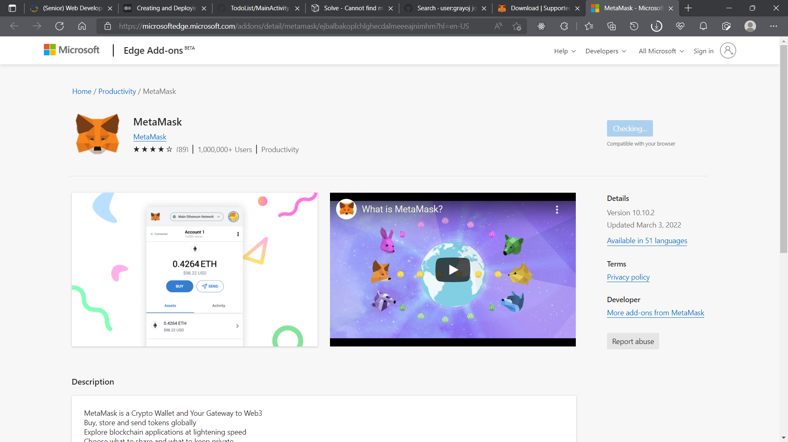
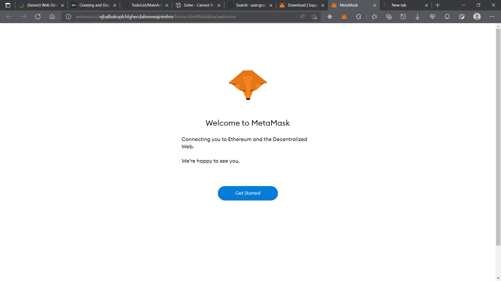
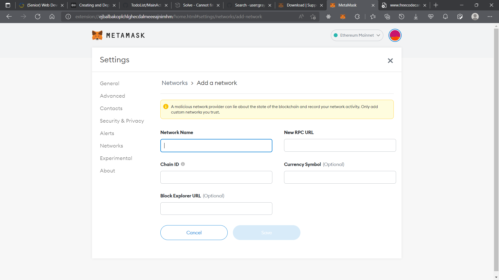
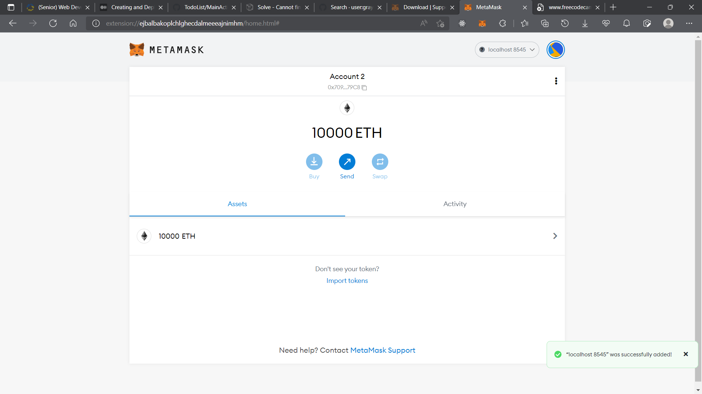
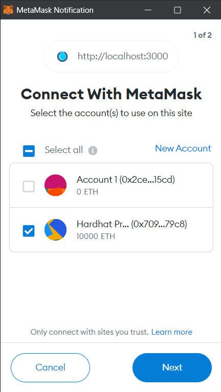
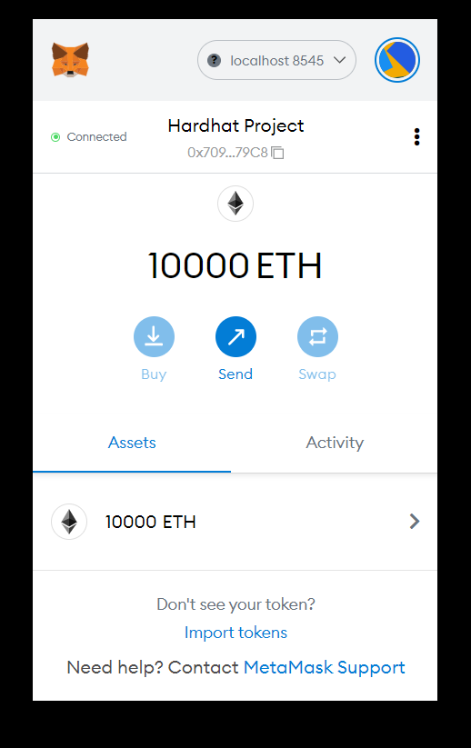
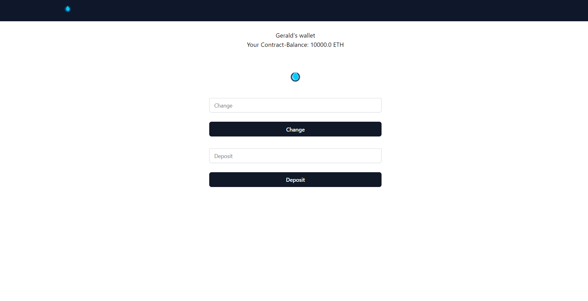
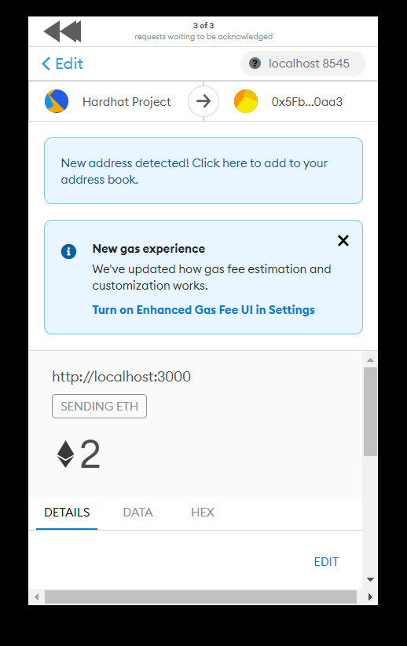

# Dribble - Hardtjs, Etherjs, Metamask Project
---


## About

Dribble is my first blockchain, web 3.0 application that you could use to deposit ethereum into a wallet using Meta Mask. This project utilises a sample contract, a test for that contract, a sample script that deploys that contract, and an example of a task implementation, which simply lists the available accounts. This project uses React JS for the client-side, NodeJS on the backend, with Hardhart js, Etherjs and Solidity.

## Requirements

1. Hardhat Js
2. Metamask
3. Ethers js
4. Node Js
5. Yarn (I used Yarn, not NPM this time.)
6. Solidity
7. Tailwind CSS
8. React JS1

## Installation

First, clone this repository


Ensure you have a nodejs server running on your machine.


Get Metamask. Download the Chrome Extension



Once it's done, proceed to the next step.



Proceed, then add a network. Localhost 8584




Done.



``yarn add``

To add and install the following dependencies

```
hardhat js
solidity
    
```
Run the following tasks in the root directory


```shell
npx hardhat accounts
npx hardhat compile
npx hardhat clean
npx hardhat test
npx hardhat node
node scripts/sample-script.js
npx hardhat help
```
On running ``npx hardhat node`` Greeter, for solidity should be deployed to a public account. Mine looks like this:
``0x5FbDB2315678afecb367f032d93F642f64180aa3``
                     
Now ``cd`` into`` client-side`` as this contains our react app. Hit ``yarn add`` to install the react app dependencies. Including Tailwindcss.

``yarn run start``

This should compile all assets and start the react app on a localhost:3000

You will receive a pop-up.



Select and next. It should connect.



Great. Now, our dribble page should have loaded.



Now you can send ETH into your local wallet!



----

Gerald Maduabuchi. MIT License